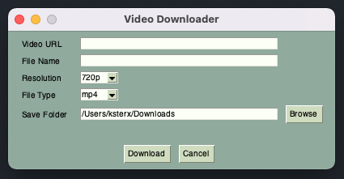

# Download YouTube Video from URL
---



## Prerequisites
```pip install pytube pysimplegui```

## Usage
```python get_video.py```

Default destination folder is `<repository>/data`.
You can change it `DEFAULT_DIR` variable in `config.py` file.
(If you generate an app in the following step, you must set the `DEFAULT_DIR` variable and it must be an absolute path.)

## App (For MacOS)
You can also applicationize this script.
```python setup.py py2app```
